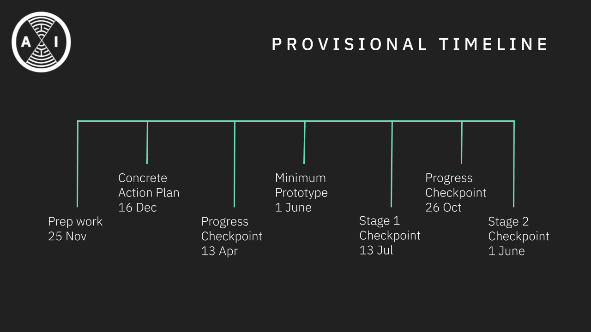

The aim of this project is to build a framework to train AI agents in social virtual reality (VR) environments. The main motivations are to explore how social interactions with humans can benefit the development of more human-like artificial intelligence, and whether it has the potential to pose a systematic risk to human society. This idea builds on top of research in developmental robotics, reinforcement learning, and psychology. However, research in human-AI social interaction has been limited by the use of expensive robots and sensing systems. We propose to massively scale up and lower the barrier for these types of experiments by using new VR technologies.

This will be an ongoing project across multiple years. The initial stage will last seven months from 25/11/2019 to 25/06/2020 and aimed towards building a standardized software framework on top of existing social VR applications e.g. [NeosVR](https://neosvr.com/), [VRChat](https://www.vrchat.com), and to test this framework by experimenting with novel learning algorithms, and novel learning tasks and environments.

    

    
    

 

Check out our [Github repo](https://github.com/oxai/vrai/), and (not yet very active) [Discord group](https://discord.gg/nYUrPM4FZU)

27/11/2019 We made a [seminar in Neos VR](https://www.youtube.com/watch?v=zReWBVZBuas&t=3205) introducing some of the motivations behind the project (and [the slides](https://docs.google.com/presentation/d/106DzzXIqv38yzSEHU4z07CcfHOEzo5YNH6Ee5V7tboo/edit?usp=sharing) from that)

<iframe src="https://docs.google.com/presentation/d/e/2PACX-1vS3CC6VUJJFrjOUoETEvZCbamYPBYRyoKhJpU9VpcH2fKY0_UIkWf9YdEPG79Q2g0cvb3bGggmeD-7P/embed?start=false&loop=false&delayms=3000" frameborder="0" width="100%" style="overflow:hidden;height:100%;width:100%" allowfullscreen="true" mozallowfullscreen="true" webkitallowfullscreen="true"></iframe>

19/01/2020 [Here](https://docs.google.com/presentation/d/14MJaKdafemxts-YRQCGNhMf2y789H2o_tYC0uxZuBHk/edit?usp=sharing) is a recent presentation with updates on the project

<iframe src="https://docs.google.com/presentation/d/e/2PACX-1vS2e2FwD8rXpb43lUKRAeBFoORoMgVx0aH0laPv31_k2qUIRuseDH2yK4sjAe4A_jVg5OBDrQuJ5ANY/embed?start=false&loop=false&delayms=3000" frameborder="0" width="100%" style="overflow:hidden;height:100%;width:100%" allowfullscreen="true" mozallowfullscreen="true" webkitallowfullscreen="true"></iframe>

<!--  -->

<!--and state-of-the-art learning techniques such as algorithms based on intrinsic motivation and curiosity, imitation learning, -->

<!--which have shown a lot of promise on efficiently learning complex behavior in rich environments [Oudeyer 2018](https://arxiv.org/abs/1802.10546)-->
